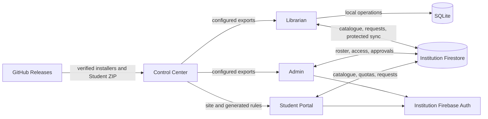

# Tomeva technical architecture

The earlier document at this path described a three-interface Libra/LokiJS prototype. Tomeva now has four separately distributed applications. See the [visual architecture](architecture.html) for the current data flows and the [README](../README.md) for setup and build commands.

## Applications and boundaries

| Application | Runtime | Data and responsibility |
| --- | --- | --- |
| Control Center | Electron desktop | Institution setup, generated Firestore rules, verified GitHub package downloads, recovery kits |
| Librarian | Electron desktop | Local SQLite circulation, books, students, transactions, fines, backups, and protected synchronization |
| Admin | Electron desktop | Staff sign-in, admission roster, student access, kiosk credentials, update approval |
| Student Portal | Institution-hosted static website | Firebase sign-in, catalogue search, book requests, messages, and account controls |

Librarian's local SQLite database is the circulation source of truth. Its day-to-day issue and return flow remains usable offline. Firestore holds public catalogue data and separately protected records for circulation, access, requests, and update policy. Each institution owns its Firebase project and hosting.

## Student request limit

The Student Portal signs users into a browser session that expires after 10 hours. Each signed-in account may create **100 book requests in a 10-hour window**. A Firestore transaction writes the request and its per-UID quota document together. Security rules require the matching increment, cap the count, and allow a new window after 10 hours. The limit covers book-request submissions; a static site cannot count or block every asset load or catalogue read per account. Deploy the updated rules and portal together because neither portal version can submit requests with the other version's rules.

## Source map

- `Control Center/`: desktop setup and distribution; `firebase-template/firestore.rules` is the deployable rules source.
- `Librarian's End/main/library-service.js` and `main/sqlite-store.js`: circulation rules and persistence.
- `Librarian's End/firestore.rules`: rules kept in sync with the Control Center template.
- `Admin's End/index.html`: administration UI and Firestore operations.
- `Student Search/search.html` and `Control Center/web-template/search.html`: matching Student Portal sources.
- `web/`: public Tomeva project website, separate from the institution-hosted Student Portal.

The desktop applications and Student Portal use GitHub Releases for downloadable packages and updates. `packages/` also carries the installers through Git LFS, with checksums and update metadata.
